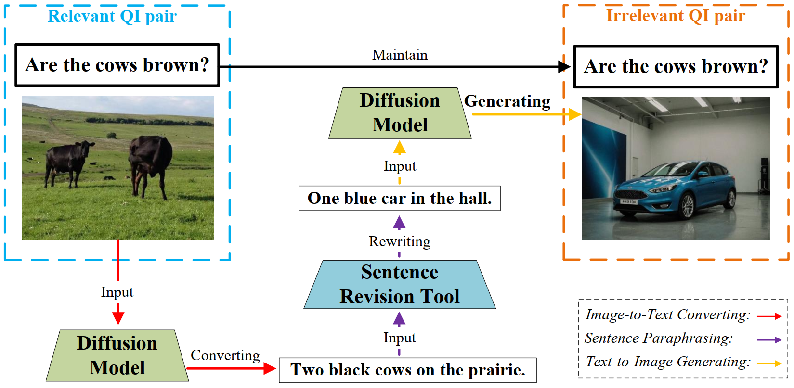
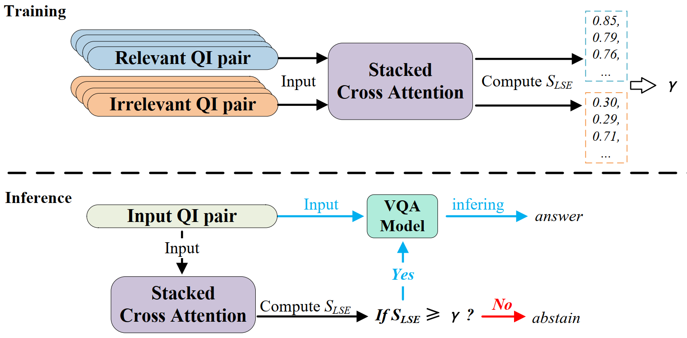
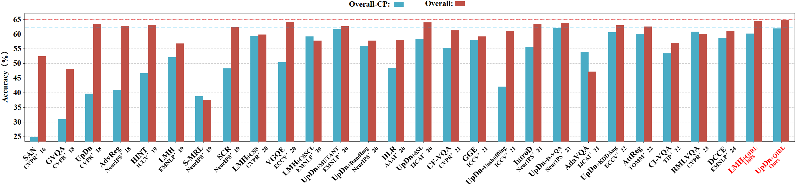

# QIRL
**QIRL: Optimized Question-Image Relation Learning for Bias-Robust Visual Question Answering.**
## Overview
QIRL is designed to improve the robustness of conventional VQA models through a generation-driven self-supervised learning strategy. Specifically, two modules are introduced. The Negative Image Generation (NIG) module automatically produces highly irrelevant QI pairs during training to strengthen relational learning. In contrast, the Irrelevant Sample Identification (ISI) module enhances model robustness by detecting and filtering out irrelevant inputs, thereby reducing prediction errors.

## NIG Module
The NIG module first converts the original image into a caption by VD, which serves as input to the sentence revision module. Next, the caption is negatively paraphrased to produce a revised sentence. Finally, VD generates a new image based on this revised sentence. The process yields a negative sample composed of the newly generated image paired with the original question.

## ISI Module
The ISI module acts as a discriminator to identify whether a QI pair is relevant or irrelevant. It is trained jointly with the VQA model to learn the correspondence between QI relevance and the degree of matching. During inference, the ISI module $j$ determines whether the VQA model $f$ should provide an answer or abstain. Specifically, the complete decision‑making mechanism $o$ is composed of both $j$ and $f$, where $j$ first evaluates the input relevance and then instructs $f$ to either output an answer or withhold prediction based on the relevance confidence.

## Quantitative Comparison
The blue dashed line and red dashed line indicate the best overall accuracies on the **VQA-CPv2** test set and **VQA-v2** validation set, respectively.

## Paper
[arXiv Paper](https://arxiv.org/abs/2504.03337)
## Citation
Citation information will be provided upon publication.
