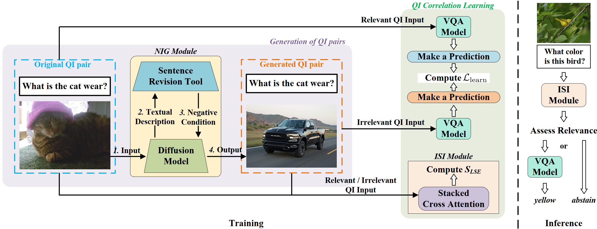

# QIRL
**QIRL: Optimized Question-Image Relation Learning for Bias-Robust Visual Question Answering
## Overview
QIRL is designed to improve the robustness of conventional VQA models through a generation-driven self-supervised learning strategy. Specifically, two modules are introduced. The \textit{Negative Image Generation} (NIG) module automatically produces highly irrelevant QI pairs during training to strengthen relational learning.

